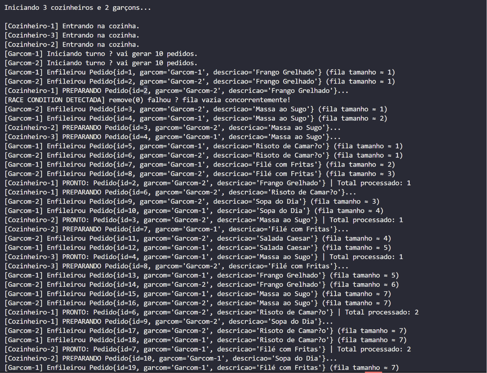
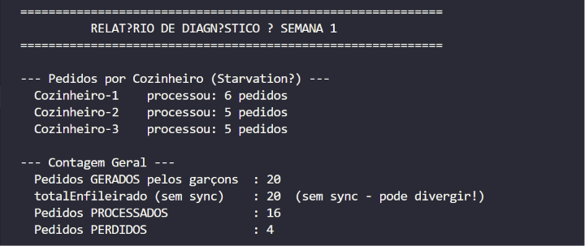
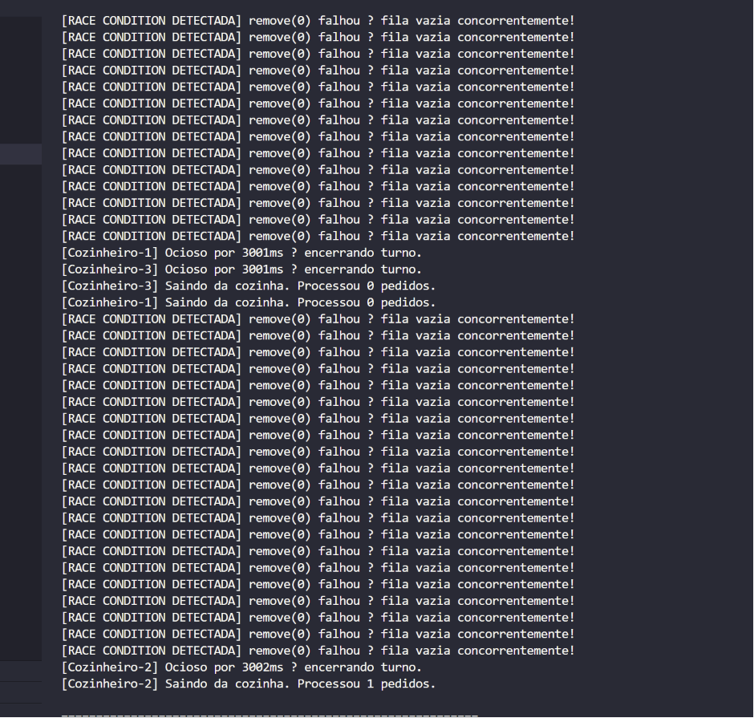
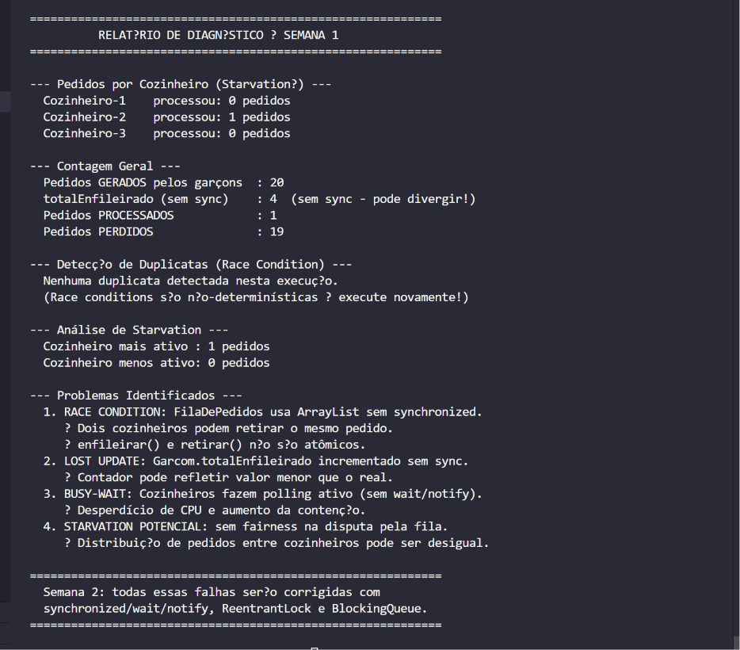

# Relatório Parcial — Semana 1
## Implementação Ingênua e Diagnóstico de Concorrência

**Disciplina:** Desenvolvimento de Software para Concorrência  
**Domínio:** Sistema de Restaurante  
**Data de entrega:** 08/06/2026  
**Tecnologia:** Java 17 puro — sem frameworks  

---

## 1. Visão Geral do Sistema

O sistema simula um restaurante onde **garçons** e **cozinheiros** operam como threads concorrentes sobre uma **fila de pedidos compartilhada**. O objetivo desta primeira semana é implementar o sistema de forma **intencional mente ingênua** — sem sincronização — e observar os problemas de concorrência que emergem.

### Configuração da simulação

| Parâmetro | Valor |
|---|---|
| Total de threads | **5** (2 garçons + 3 cozinheiros) |
| Pedidos por garçom | 10 |
| Total de pedidos gerados | 20 |
| Capacidade máxima da fila | 15 |
| Tempo de preparo por pedido | 50 ms |

### Mapeamento de entidades

| Classe | Papel na concorrência |
|---|---|
| `Pedido` | Unidade de trabalho produzida |
| `Garcom` | Thread **produtora** — enfileira pedidos |
| `Cozinheiro` | Thread **consumidora** — processa pedidos |
| `FilaDePedidos` | Buffer compartilhado **não sincronizado** |

---

## 2. Trecho de Código — Pontos Críticos

### 2.1 `FilaDePedidos.java` — Race condition no acesso ao `ArrayList`

```java
// PROBLEMA: size() e remove(0) não são atômicos.
public Pedido retirar() {
    if (fila.isEmpty()) {   // Thread A lê: "tem 1 item"
        return null;
    }
    try {
        return fila.remove(0); // Thread B já removeu → IndexOutOfBoundsException
    } catch (IndexOutOfBoundsException e) {
        System.out.println("[RACE CONDITION DETECTADA] remove(0) falhou — fila vazia concorrentemente!");
        return null;
    }
}
```

> **Raiz do problema:** `ArrayList` não é thread-safe. A verificação `isEmpty()` e a ação `remove(0)` não são atômicas — outra thread pode agir entre os dois passos.

---

### 2.2 `Garcom.java` — Lost Update no contador compartilhado

```java
// PROBLEMA: campo estático compartilhado, incrementado sem synchronized.
// Dois garçons podem ler o mesmo valor e gerar IDs duplicados.
static int totalEnfileirado = 0;

// Dentro de run():
int idPedido = ++totalEnfileirado; // ← operação não atômica (read → increment → write)
```

---

### 2.3 `Cozinheiro.java` — Busy-wait sem `wait/notify`

```java
// PROBLEMA: polling ativo consome CPU desnecessariamente.
// Correto seria usar BlockingQueue.take() ou wait() condicional.
while (true) {
    Pedido pedido = fila.retirar(); // chama remove() repetidamente
    if (pedido == null) {
        Thread.sleep(TEMPO_ESPERA_MS); // ← não é sincronização real
        continue;
    }
    // processa...
}
```

---

## 3. Logs de Execução

As execuções abaixo foram capturadas em rodadas distintas do mesmo código, sem nenhuma alteração. A variação nos resultados evidencia o **comportamento não-determinístico** das race conditions.

---

### Execução A — Race condition moderada (4 pedidos perdidos)

> 20 pedidos foram gerados. Apenas 16 foram processados. 4 desapareceram silenciosamente.

**Log de início da simulação:**



**Relatório de diagnóstico:**



**Análise:**

| Métrica | Valor |
|---|---|
| Pedidos gerados | 20 |
| Pedidos processados | 16 |
| **Pedidos perdidos** | **4** |
| Duplicatas detectadas | Nenhuma |
| Distribuição entre cozinheiros | 6 / 5 / 5 |

Nesta execução, os cozinheiros competiram pela fila de forma que 4 pedidos foram "vistos" por múltiplas threads no instante em que `isEmpty()` era `false`, mas quando `remove(0)` foi chamado, o item já havia sido removido por outro cozinheiro — resultando em `null` retornado silenciosamente, sem reprocessamento.

---

### Execução B — Race condition severa (19 pedidos perdidos + avalanche de erros)

> Caso extremo: apenas 1 pedido foi processado com sucesso. Os outros 19 foram perdidos. Centenas de `[RACE CONDITION DETECTADA]` foram emitidos.

**Log intermediário — avalanche de `IndexOutOfBoundsException`:**



**Relatório de diagnóstico:**



**Análise:**

| Métrica | Valor |
|---|---|
| Pedidos gerados | 20 |
| `totalEnfileirado` (sem sync) | **4** ← Lost Update |
| Pedidos processados | **1** |
| **Pedidos perdidos** | **19** |
| Duplicatas detectadas | Nenhuma |
| Distribuição entre cozinheiros | 0 / 1 / 0 |

Esta é a manifestação mais destrutiva da race condition. O escalonador da JVM fez com que os 3 cozinheiros chegassem simultaneamente à fila em cada ciclo. O padrão TOCTOU se repetiu centenas de vezes:

```
Fila: [Pedido#X]

Cozinheiro-1: isEmpty() → false  ✓
Cozinheiro-2: isEmpty() → false  ✓   ← todos leram ao mesmo tempo
Cozinheiro-3: isEmpty() → false  ✓

Cozinheiro-1: remove(0) → Pedido#X  ✓
Cozinheiro-2: remove(0) → IndexOutOfBoundsException  ❌
Cozinheiro-3: remove(0) → IndexOutOfBoundsException  ❌
```

O `totalEnfileirado = 4` (em vez de 20) evidencia o **Lost Update**: dois garçons leram `totalEnfileirado` com o mesmo valor, incrementaram localmente e escreveram de volta, sobrescrevendo o incremento um do outro.

---

## 4. Diagnóstico dos Problemas Identificados

### Problema 1 — Race Condition (TOCTOU)

| Campo | Detalhe |
|---|---|
| **Classe afetada** | `FilaDePedidos` |
| **Padrão** | Time-of-Check to Time-of-Use |
| **Causa** | `isEmpty()` e `remove(0)` não são atômicos sobre `ArrayList` |
| **Efeito observado** | Pedidos perdidos; `IndexOutOfBoundsException` capturada |
| **Correção (Semana 2)** | Substituir `ArrayList` por `LinkedBlockingQueue` |

---

### Problema 2 — Lost Update

| Campo | Detalhe |
|---|---|
| **Classe afetada** | `Garcom` |
| **Campo** | `static int totalEnfileirado` |
| **Causa** | `++` não é atômico: é uma sequência de `read → add → write` |
| **Efeito observado** | Contador final diverge do total real de pedidos |
| **Correção (Semana 2)** | Usar `AtomicInteger` ou bloco `synchronized` |

---

### Problema 3 — Busy-Wait

| Campo | Detalhe |
|---|---|
| **Classe afetada** | `Cozinheiro` |
| **Causa** | Loop `while(true)` com `Thread.sleep()` curto no lugar de bloqueio real |
| **Efeito observado** | Aumento da contenção na fila; alto uso de CPU em fila vazia |
| **Correção (Semana 2)** | Usar `BlockingQueue.take()` que bloqueia até haver item disponível |

---

### Problema 4 — Starvation Potencial

| Campo | Detalhe |
|---|---|
| **Classes afetadas** | `Cozinheiro`, `FilaDePedidos` |
| **Causa** | Sem mecanismo de fairness — cozinheiros competem livremente |
| **Efeito observado** | Execução B: distribuição 0/1/0 (dois cozinheiros ficaram completamente ociosos) |
| **Correção (Semana 2)** | `ReentrantLock(true)` (fair lock) ou `BlockingQueue` com política FIFO |

---

## 5. Conclusão

A implementação ingênua demonstrou, em execuções reais, que **a ausência de sincronização em um ambiente multi-thread produz resultados imprevisíveis e destrutivos**. O mesmo código, sem nenhuma alteração, gerou resultados radicalmente diferentes entre as execuções — de 4 pedidos perdidos (Execução A) a 19 pedidos perdidos (Execução B) — evidenciando o caráter **não-determinístico** das race conditions.

Os quatro problemas identificados e catalogados neste relatório serão corrigidos na Semana 2 com os mecanismos adequados da API `java.util.concurrent`:

| Problema | Mecanismo da Semana 2 |
|---|---|
| Race Condition na fila | `LinkedBlockingQueue` |
| Lost Update no contador | `AtomicInteger` |
| Busy-Wait | `BlockingQueue.take()` |
| Starvation | `ReentrantLock(fair=true)` |

---

> **Nota:** As imagens desta seção são capturas reais do terminal durante a execução do código-fonte presente em `src/semana1/`. Substituir os placeholders `./img_*.png` pelas capturas de tela salvas antes de converter para PDF.
